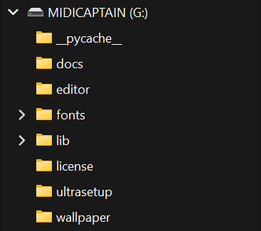
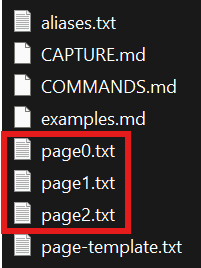

# Device configuration

Configuration is done **via editing of text files**. 
A companion editor will be available  in the future.

### Connect device in edit mode

* Make sure the MIDI Captain Midi 6 is turned of
* Connect the MIDI Captain Mini 6 to your computer via USB 
* Turn the device on **while keeping key 0 (the first, upper 
  left corner) pressed**.
* You should now see the device listed as **external
  USB drive** labeled MIDICAPTAIN



### How to edit

Configuration files are `.txt` files directly under `/ultrasetup/` and can
be edited with any text editor. Each file is a complete configuration
(see [Multiple configurations](#multiple-configurations) below).

The filename (without `.txt`) is the configuration name shown in Explorer Mode.
For example, `init.txt` appears as "init", and `Metallica Coverband.txt`
appears as "Metallica Coverband".

A single config file contains:
1. One `[global]` section (shared settings for all pages)
2. One or more `[page]` sections, each followed by its `[keyN]` sections

Pages are numbered progressively from 0 in the order they appear in the file.



#### File format

Values are grouped in **sections**, defined as `[sectionName]`.

Assignments are done with this format:

```
config_param1 = [val1]
config_param2 = [val1][val2]
config_param3 = [val1][val2][val3] [val4][val5][val6]
```

* you can assign a single value when suitable, string or numeric
* you can assign a **tuple**
* you can assign an **array of tuples**

Within a tuple, `[*]` repeats the previous value:

```
led1 = [C_GREEN][*][*]   ; same as [C_GREEN][C_GREEN][C_GREEN]
led1 = [-][C_RED][*]     ; same as [-][C_RED][C_RED]
```

`[*]` as the first token (no prior value) is treated as null (no change).

>You can find a complete breakdown of the file format specs
> in [the config template file](../ultrasetup/config-template.txt).

### Multiple configurations

The device can store several independent configurations. Each one is a `.txt`
file directly under `ultrasetup/`:

```
ultrasetup/
  aliases.txt            <-- global aliases (shared by all configs)
  config-template.txt    <-- reference template (not loaded by firmware)
  init.txt               <-- a config file (all pages in one file)
  live_rig.txt           <-- another config file
```

Each file is a self-contained configuration with all its pages.
The `aliases.txt` file is global and shared across all configurations.

**Startup rule:** The firmware loads `init.txt` on boot. If that file does not
exist, the first config file alphabetically is loaded instead. If no config
files exist, the firmware starts with an empty default config.

**Switching at runtime:** Hold **SW3 + SWA** simultaneously for 0.5 s to open
Explorer Mode — a full-screen config browser. The display shows a scrollable
list of all available configs. Use the footswitches to navigate:

| Key | Action |
|-----|--------|
| SW1 (key 0) | Cursor up |
| SW2 (key 1) | Page up (6 items) |
| SW3 (key 2) | Cancel (exit, no change) |
| SWA (key 3) | Cursor down |
| SWB (key 4) | Page down (6 items) |
| SWC (key 5) | Confirm (load selected config) |

LEDs indicate each key's role: purple for navigation, cyan for page scroll,
red for cancel, green for confirm. LEDs are dim at idle and brighten on press.

See [Explorer Mode in PAGES.md](PAGES.md#explorer-mode--switching-configs-at-runtime)
for the full reference including display layout and color coding.

#### Caveat

> **Warning:** When creating, deleting or updating the file, 
> it's not advisable to disconnect the device, **as filesystem
> corruption can occur during the firmware update**, making
> the device unusable. This is especially important because
> the I/O operatons **are slow** on this board.
>
> Always use **soft boot** to reboot instead of turning off
> and on; if you need to turn off and on, wait some seconds
> after any save, copy or delete operations.


  
